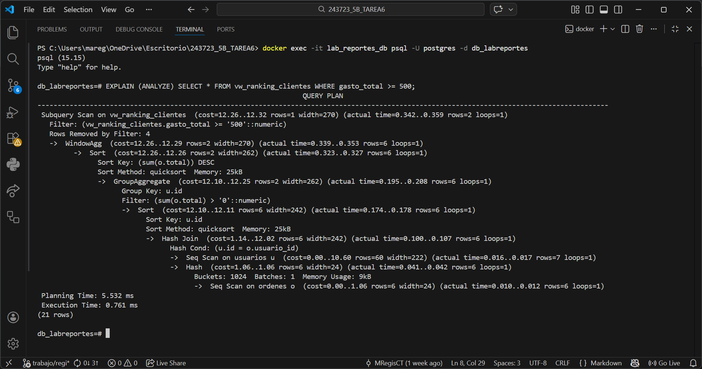

# Sistema de Reportes de Laboratorio - Tarea 6

Este proyecto implementa PostgreSQL + Views + NextJs + DockerCompose. La arquitectura se basa en un entorno de contenedores en **Docker** con **Next.js** y **PostgreSQL**, priorizando la optimización de consultas y la seguridad de los datos.

## Indexes
Se implementaron índices estratégicos en el archivo 04_indexes.sql para optimizar el rendimiento del motor de base de datos, se crearon índices en llaves foráneas para acelerar los JOINs entre tablas de gran tamaño, se utilizo IF NOT EXISTS para garantizar que la inicialización del contenedor no se interrumpa si el índice ya fue creado por el esquema base.

### Justificación de Indexes

#### idx_orden_detalles_producto_id
**Justificación:** Hace un JOIN constante entre las tablas productos y orden_detalles. Sin este índice, PostgreSQL tendría que realizar un "Sequential Scan" (leer cada fila de la tabla de detalles) para encontrar las ventas de un producto, gracias a esta implementación, la búsqueda se transforma a un "Index Scan"

#### idx_ordenes_created_at
**Justificación:** Vistas como vw_ventas_mensuales e vw_ingresos_acumulados, dependen de funciones de tiempo como EXTRACT(MONTH...) y DATE(created_at). Además, la vista de ingresos acumulados requiere un ordenamiento cronológico estricto (ORDER BY fecha), este índice permite reducir el costo computacional del GROUP BY por fechas y agiliza las funciones de ventana (Window Functions) que calculan totales acumulados.

#### idx_ordenes_usuario_id
**Justificación:** vw_clientes_valor y vw_ranking_clientes se centran en el comportamiento del cliente, uniendo la tabla usuarios con ordenes, al implementar este índice, la llave foránea usuario_id, puede agrupar rápidamente todas las compras pertenecientes a un solo cliente. Esto es vital para que la función RANK() pueda procesar el gasto total y asignar posiciones en el ranking

## Views
Las vistas se encuentran en 05_reports_vw.sql. Next.js consume datos de vistas limpias, evitando que el código de la aplicación deba manejar lógica SQL compleja directamente, las vistas permiten mostrar solo los datos necesarios para los reportes sin exponer la estructura interna completa de las tablas base.

### Justificación de Vistas

#### 1. vw_top_productos
**Justificación:** Esta vista centraliza el rendimiento de cada producto. Es fundamental para el equipo de compras y marketing. Se utilizó `CASE` condicional combinado con `RANK()` para dividir los productos automáticamente entre "Producto Estrella" o "Regular". El uso de `NULLIF` previene errores de división por cero en el cálculo del precio promedio. El uso de `HAVING` garantiza que el reporte muestre únicamente artículos que han generado ventas.

#### 2. vw_ventas_mensuales
**Justificación:** Permite identificar la estacionalidad de las ventas. Es la base para proyecciones financieras y comparativas mes a mes.Se usa `EXTRACT` para normalizar fechas y `COUNT(DISTINCT o.id)` para asegurar un conteo preciso de transacciones, evitando duplicidades causadas por los múltiples detalles que puede tener una sola orden. Su uso facilitaría la creación de gráficas de líneas en el Frontend al entregar los datos ya agrupados por periodos cronológicos.

#### 3. vw_clientes_valor
**Justificación:** Identifica a los clientes que generan el mayor flujo de caja. Se usa `COALESCE` para manejar valores nulos en el gasto total y `ROUND` para estandarizar la salida a dos decimales, realiza un `JOIN` entre las tablas de identidad (`usuarios`) y transacciones (`ordenes`).

#### 4. vw_ranking_clientes
**Justificación:** Establece un ranking de clientes basada en sus compras. Implementa una **Window Function** (`RANK() OVER`). A diferencia de un simple `ORDER BY`, el ranking permite asignar una posición numérica que persiste incluso si se aplican filtros adicionales en la consulta, manteniendo la integridad de la posición del cliente en la tabla global.

#### 5. vw_ingresos_acumulados
**Justificación:** Muestra el crecimiento del capital día a día y el acumulado con en el tiempo. Common Table Expression: El uso de `WITH` permite separar la consulta, calculando primero los ingresos diarios para luego procesarlos, utiliza un `SUM(...) OVER (ORDER BY fecha)` para crear una suma acumulativa.

## Roles
En el archivo 06_roles.sql se aplicó el estándar de seguridad de Mínimo Privilegio, se creó el rol view_user específicamente para la capa web y se revocaron explícitamente los permisos de INSERT, UPDATE y DELETE.

## Flujo de Inicialización
La base de datos se construye siguiendo una jerarquía de dependencias lógica:
1) 01_schema.sql: Esquema de la base de datos (Tablas y estructura general)
2) 02_seed.sql: Insercción de datos semillas (datos de prueba)
3) 03_migrate.sql: Ajustes de última hora para la integridad referencial
4) 04_indexes.sql: Optimización de velocidad sobre las tablas ya pobladas
5) 05_reports_vw.sql: Transforman datos crudos en información estratégica
6) 06_roles.sql: Creación del usuario web

## Estructura del Trabajo
- Front: Aplicación Next.js configurada para conectar con la base de datos mediante variables de entorno seguras (solo tiene acceso a views)
- db: Todo lo relacionado a SQL, con los archivos mencionados anteriormente
- docker-compose.yml: Configuración de red interna y persistencia de datos mediante volúmenes
- .env: Gestión de credenciales y configuración de acceso al host de base de datos

## Despliegue Rápido

```bash
# Levantar el entorno y construir imágenes
docker compose up --build
# o 
docker compose up -d

# En caso de requerir un reinicio total (limpieza de volúmenes)
docker compose down -v
```
Una vez finalizado el proceso, puedes acceder a:
- Frontend: http://localhost:3000
- Base de Datos: Puerto 5432

## Trade-offs: SQL vs Next.js

### Decisiones de Arquitectura

1. **Cálculos en SQL (Window Functions)**
   - **Por qué:** `RANK() OVER` y `SUM() OVER` en PostgreSQL son más eficientes que ordenar y acumular en JS
   - **Ventaja:** Reduce transferencia de datos entre DB y App
   - **Trade-off:** Mayor complejidad en queries, pero mejor performance

2. **GROUP BY en Views**
   - **Por qué:** Agregar datos en la base reduce el tamaño del payload enviado a Next.js
   - **Ventaja:** Menos datos en red nos da respuestas más rápidas
   - **Trade-off:** Menor flexibilidad para re-agrupar datos en frontend

3. **Common Table Expressions (CTE)**
   - **Por qué:** `WITH` en `vw_ingresos_acumulados` permite separar lógica de cálculo diario del acumulado
   - **Ventaja:** Query más legible y mantenible
   - **Trade-off:** Puede ser más lento que JOINs en bases muy grandes (aquí no aplica)

4. **Validación con Zod en Server Components**
   - **Por qué:** Validar parámetros antes de ejecutar SQL previene inyección y errores
   - **Ventaja:** Seguridad + UX (errores claros)
   - **Trade-off:** Código extra en cada página con filtros

5. **Paginación Server-side (LIMIT/OFFSET)**
   - **Por qué:** Evita cargar miles de registros innecesariamente
   - **Ventaja:** Memoria y tiempo de carga reducidos
   - **Trade-off:** UX menos fluido que infinite scroll (pero más simple)


## Performance Evidence

### 1. Evidencia: Vista con Funciones de Ventana (Ranking VIP)

**Query ejecutada:**
```sql
EXPLAIN (ANALYZE) 
SELECT * FROM vw_ranking_clientes WHERE gasto_total >= 500;
```

**Resultado:**


**Explicación:**
- El nodo WindowAgg indica el cálculo de la función RANK().
- Justificación: El uso de índices en las llaves foráneas de las tablas base reduce el tiempo de escaneo antes de realizar el agrupamiento.

### 2. Evidencia: Vista con Filtros y Paginación (Top Productos)

**Query ejecutada:**
```sql
EXPLAIN (ANALYZE) 
SELECT * FROM vw_top_productos LIMIT 4 OFFSET 0;
```

**Resultado:**


**Explicación:**
- El nodo Limit confirma que la base de datos deja de procesar filas una vez que encuentra las primeras 4 solicitadas, ahorrando recursos.
- Justificación: La paginación server-side previene que el servidor envíe miles de registros innecesarios al frontend, optimizando el ancho de banda y el tiempo de respuesta.

## Threat Model Mínimo

### Vectores de Ataque Prevenidos

1. **SQL Injection**
   - **Prevención:** Uso exclusivo de queries parametrizadas (`$1`, `$2`, `$3`)
   - **Validación:** Zod valida tipos antes de pasar a SQL
   - **No vulnerable:** Nunca concatenamos strings para construir SQL
   - **Ejemplo:** `query('SELECT * FROM vw WHERE id = $1', [userId])` en vez de `` `SELECT * WHERE id = ${userId}` ``

2. **Exposición de Credenciales**
   - **Prevención:** Variables de entorno en `.env` (nunca en código)
   - **Git:** `.env` en `.gitignore`, solo `.env.example` versionado
   - **Separación:** `view_user` con permisos mínimos (no `postgres`)
   - **Evidencia:** `front/lib/db.js` usa `process.env.DB_PASSWORD`

3. **Privilegios Excesivos (Principle of Least Privilege)**
   - **Usuario dedicado:** `view_user` solo tiene `SELECT` en views (no tablas)
   - **REVOKE:** Permisos de `CREATE` revocados explícitamente
   - **No superuser:** App no se conecta como `postgres`
   - **Código:** Ver `db/06_roles.sql` líneas 1-17

4. **Inyección via Input No Validado**
   - **Zod schemas:** Validan `page` (número positivo) y `minGasto` (número >= 0)
   - **Whitelist:** Solo parámetros conocidos aceptados
   - **No vulnerable:** No hay `ORDER BY` dinámico basado en input
   - **Ejemplo:** `PageSchema.parse()` rechaza strings maliciosos antes de SQL

5. **Information Disclosure**
   - **Views:** Frontend solo ve datos agregados, no tablas raw
   - **Errores genéricos:** Next.js no expone stack traces de SQL en producción
   - **Mejora posible:** Logs de errores SQL solo en server-side

6. **Denial of Service (DoS) - Queries Costosas**
   - **LIMIT:** Paginación limita resultados a 5 registros máximo (top productos) o 4 (ranking de usuarios)
   - **Índices:** Evitan full table scans


## Bitácora de IA

#### 1. **Paginación Server-side con Zod**
**Prompt usado:**
> "Implementa paginación LIMIT/OFFSET en Next.js 14 App Router con validación Zod del parámetro 'page'"

**Resultado generado:**
```tsx
const PageSchema = z.object({ page: z.coerce.number().min(1).default(1) });
const { page } = PageSchema.parse(searchParams);
const res = await query('SELECT * FROM view LIMIT $1 OFFSET $2', [10, (page-1)*10]);
```
Funcionó correctamente en localhost, pero no mostraba el total de páginas entonces agregué una query adicional con `COUNT(*)`

**Corrección aplicada:**
```tsx
const countRes = await query('SELECT COUNT(*) FROM vw_top_productos');
const totalCount = parseInt(countRes.rows[0].count);
```

#### 2. **Índices Estratégicos**
**Prompt usado:**
> "Qué índices debería crear para optimizar una view que hace JOIN entre productos y orden_detalles con GROUP BY producto_id"

**Respuesta de IA:**
- Índice en `orden_detalles.producto_id` (foreign key)
- Índice en `ordenes.created_at` (para filtros de fecha)

#### 3. **Roles**
**Prompt usado:**
> "Cómo crear un rol en postgresql con permisos minimos"

**Respuesta de IA:**
```sql
-- 1. Crear el usuario con contraseña
CREATE ROLE analista_ventas WITH 
    LOGIN 
    PASSWORD 'contraseña_segura_123'
    NOSUPERUSER    -- No es Dios
    NOCREATEDB     -- No puede crear bases de datos
    NOCREATEROLE   -- No puede crear otros usuarios
    NOINHERIT;     -- No hereda permisos automáticamente (seguridad extra)
-- 2. Permitirle conectarse a la base de datos específica
GRANT CONNECT ON DATABASE mi_ecommerce TO analista_ventas;
-- 3. Permitir "usar" el esquema public (entrar al pasillo)
GRANT USAGE ON SCHEMA public TO analista_ventas;
-- 4. Dar permiso SOLO de lectura (SELECT) en tablas específicas
GRANT SELECT ON TABLE ordenes, orden_detalles, productos, categorias TO analista_ventas;

-- IMPORTANTE: NO le damos permiso sobre la tabla 'usuarios'
-- Si intenta: SELECT * FROM usuarios; -> Recibirá "Permission denied"
```
Aquí utilice este pedazo que me dio de ejemplo para poder crear mi usuario con permisos a las vistas 

#### 4. **CTE**
**Prompt usado:**
> Qué es un CTE

**Respuesta de IA:**
- **¿Qué es?**
Imagina que estás resolviendo un problema matemático complejo. En lugar de hacer todo el cálculo en una sola línea mental, escribes resultados intermedios en una hoja de papel aparte para usarlos después.
Un CTE es esa "hoja de papel". Es una tabla temporal que creas al inicio de tu consulta, le pones un nombre, y la usas como si fuera una tabla real dentro de tu SELECT principal. Solo existe mientras dura la ejecución de esa consulta.

- **¿Para qué sirve?**
- Legibilidad: Evita los "nidos de espagueti" (subconsultas dentro de subconsultas dentro de subconsultas).
- Organización: Te permite romper un problema grande en pasos pequeños (Paso 1, Paso 2, Resultado).

Ejemplo Práctico:

```sql
-- Paso 1: Calculamos cuánto gastó cada usuario (La hoja de papel)
WITH GastosPorUsuario AS (
    SELECT usuario_id, SUM(total) as total_gastado
    FROM ordenes
    GROUP BY usuario_id
)

-- Paso 2: Usamos ese resultado para filtrar y poner nombres bonitos
SELECT u.nombre, g.total_gastado
FROM usuarios u
JOIN GastosPorUsuario g ON u.id = g.usuario_id -- ¡Aquí usamos el CTE!
WHERE g.total_gastado > 1000;
```

#### 5. **Window Functions**
**Prompt usado:**
> Qué es una Window Function

**Respuesta de IA:**
- **¿Qué son?**
Esta es la parte donde muchos se confunden con el GROUP BY.
- GROUP BY: Toma 10 filas y las aplasta en 1 sola fila resumen (pierdes el detalle individual).
- Window Function: Toma 10 filas, mantiene las 10 filas, pero agrega una columna extra con un cálculo basado en un grupo (ventana) de datos.

- **Palabras Clave:**
- OVER (...): Esto activa la función de ventana. Le dice a SQL: "No agrupes las filas, solo mira a través de esta ventana".
- PARTITION BY: Es como el GROUP BY pero solo para esa columna específica. Define "la ventana".
- ORDER BY: Define el orden dentro de esa ventana (crucial para rankings).

Ejemplo Práctico

```sql
SELECT 
    nombre AS producto,
    categoria_id,
    precio,
    -- Aquí viene la magia:
    AVG(precio) OVER (PARTITION BY categoria_id) as precio_promedio_categoria
FROM productos;
```

#### 6. **CSS**
**Prompt usado:**
> De acuerdo a esta paleta de colores (se anexó paleta de colores) ayudame a darle css a mis vistas, no cambies nada de la lógica que lleva, solo dale css puro

**Respuesta de IA:**
El CSS de las vistas.

### Resumen de Uso de IA
- **Total de prompts:** 6
- **Tiempo ahorrado estimado:** ~3 horas (entre investigación y escribir)